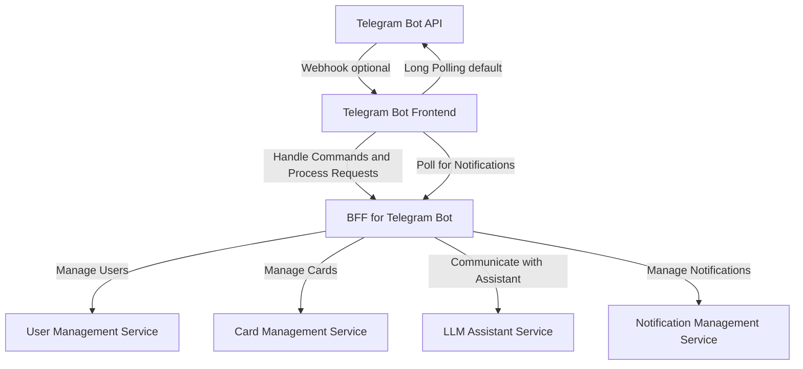

# Interval Repetition System with LLM-based Evaluation

This project is developed for educational and practical purposes. It implements a **microservice architecture** for an **interval repetition system** that utilizes an **LLM (Language Model)** to evaluate user responses. The system supports creating, managing, and reviewing cards (questions/prompts) with increasing intervals, offering an enhanced experience for learning and knowledge retention.

## Architecture Overview



### Components

1. **Telegram Bot API:** Handles interaction with Telegram through webhooks or long polling.
2. **Telegram Frontend:** Processes user commands and polls for notifications, connecting users with the system.
3. **BFF (Backends for Frontends):** Acts as an intermediary between the frontend and microservices, managing:
   - User interactions
   - Card operations
   - Notifications
   - LLM communication
4. **Microservices:**
   - **User Service:** Manages user data and authentication.
   - **Card Service:** Handles card creation, updates, and retrieval.
   - **Assistant Service:** Interacts with the LLM for evaluating user responses.
   - **Notification Service:** Manages scheduling and delivery of notifications.

---

## Features

- **Interval Repetition Workflow:** Automatically adjusts review intervals based on user feedback.
- **LLM Integration:** Evaluates user responses and provides detailed feedback for improvement.
- **Telegram Bot Integration:** Offers a user-friendly interface via Telegram.
- **Microservice Architecture:** Ensures scalability, flexibility, and maintainability.
- **Decoupled Communication:** Services interact via HTTP or message queues, making the system robust and easily extensible.

---

## Installation

Each microservice and component is maintained in its own repository. Follow the setup instructions for each service below.

### Repositories

**[Telegram Frontend (Server)](#)**  
   Handles user interaction via Telegram.  

**[Telegram backend (Server)](#)**  
   Serves as the central API for managing user commands and routing requests to microservices.

**[Telegram backend (Client)](#)**  
   Client for Telegram backend server

**[User Service (Server)](#)**  
   Manages user data and authentication.

**[Card Service (Server)](#)**  
   API for creating and managing cards for interval repetition.

**[Card Service (Client)](#)**  
   Client library for interacting with the Card Service.

**[Assistant Service](#)**  
   Evaluates user answers via LLM.


**[Notification Service](#)**  
   Schedules and delivers reminders for repetition tasks.

---

## Getting Started

1. **Clone all repositories:**  
   ```
   git clone <Telegram Frontend Repo>
   git clone <BFF Repo>
   git clone <User Service Repo>
   git clone <Card Service Server Repo>
   git clone <Card Service Client Repo>
   git clone <Assistant Service Repo>
   git clone <Notification Service Repo>
   ```

2. **Set up the environment:**  
   Refer to the individual `README.md` files in each repository for detailed setup instructions.

3. **Run the system:**  
   - Start each service in the appropriate order (User Service, Card Service, etc.).
   - Launch the Telegram frontend to interact with the bot.

---

## Contributing

Feel free to contribute to the project! Fork any of the repositories, make your changes, and submit a pull request.

---

## License

This project is released under the [MIT License](LICENSE). You are free to use, modify, and distribute the code as per the terms of the license.

---